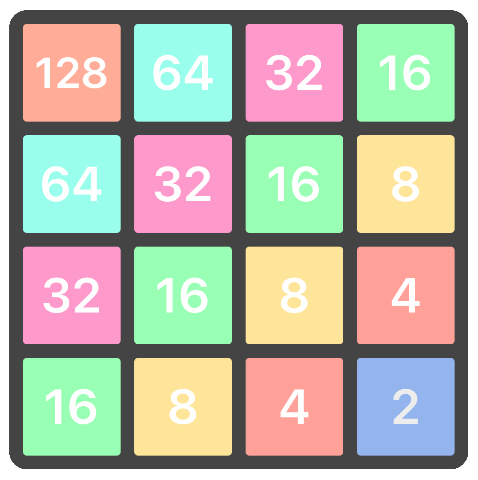

# 2048 Game

A basic 2048 game made with HTML, CSS and JavaScript

### General Overview

The tiles are styled and positioned using CSS based on classes and custom attributes. An ordered array of 16 tile elements is kept in sync with the DOM.

